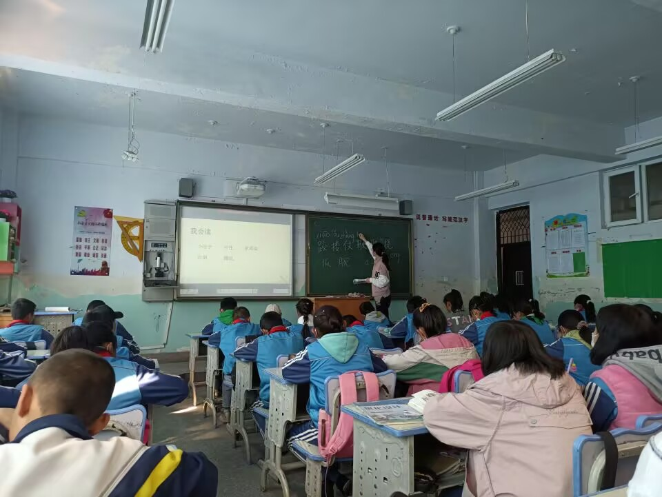

## *News:* I am currently looking for 26 Spring & Fall PhD Positions!

***Current Research Interests***: Sustainability in Higher Education, EduTech (Game-Based Learning), SDG4-Quality Education [ -> See my research works ](https://weiqiuzhang.github.io/research/)

## About me

I got my MA in *Education for Sustainability* from [The Education University of Hong Kong](https://www.eduhk.hk/en/) at 2024. Prior to that, at 2022 I got my BA degree from [Northwest Normal University](https://en.wikipedia.org/wiki/Northwest_Normal_University), during which I got the **China Mainland Senior Secondary School Teacher's Qualification** and by which I passed the **Hong Kong SAR BEd qualification (Equivalent to Honoured Bachelor of Education)**.

Currently, I serve as a Teaching Assistant at [Hong Kong Metropolitan University](https://www.hkmu.edu.hk/), starting from 2025 Spring Term. I was also a former K-12 teacher for Chinese Subject; the time in *Hualin Township Central School* with left-behind ethnic minority students became an unforgettable memory of mine: below is a photo of my class there.

    

 